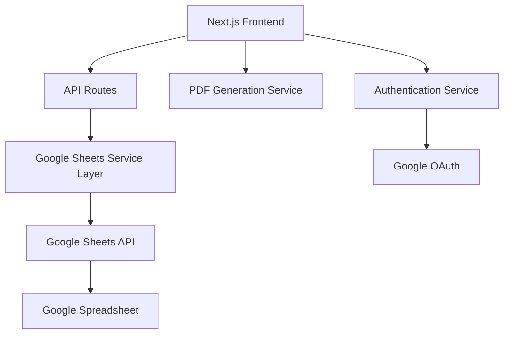

# Design Document

## Overview

Billing Monk will be built as a modern web application using Next.js 14+ with the App Router, TypeScript for type safety, and Google Sheets as the backend data store. The application will follow a component-based architecture with clear separation between UI components, business logic, and data access layers, with specific adaptations for Indian business requirements.

The system will use Google Sheets API v4 for data operations, with each major entity (clients, invoices, payments, settings) stored in separate sheets within a single Google Spreadsheet. The frontend will be responsive and mobile-friendly, using Tailwind CSS for styling and React Hook Form for form management. The application will include Indian-specific features like GST compliance, INR currency support, and Indian date formats.

## Architecture

### High-Level Architecture



### Technology Stack

- **Frontend Framework**: Next.js 14+ with App Router
- **Language**: TypeScript
- **Styling**: Tailwind CSS
- **UI Components**: Headless UI or Radix UI
- **Forms**: React Hook Form with Zod validation
- **State Management**: React Context + useReducer for complex state
- **PDF Generation**: jsPDF or Puppeteer
- **Authentication**: NextAuth.js with Google OAuth
- **Data Storage**: Google Sheets API v4
- **Charts**: Chart.js or Recharts for analytics

## Components and Interfaces

### Core Components Structure

```
src/
├── app/
│   ├── (dashboard)/
│   │   ├── clients/
│   │   ├── invoices/
│   │   ├── templates/
│   │   ├── payments/
│   │   ├── reports/
│   │   └── settings/
│   ├── api/
│   │   ├── clients/
│   │   ├── invoices/
│   │   ├── templates/
│   │   ├── payments/
│   │   └── sheets/
│   └── globals.css
├── components/
│   ├── ui/
│   ├── forms/
│   ├── tables/
│   └── charts/
├── lib/
│   ├── google-sheets.ts
│   ├── pdf-generator.ts
│   ├── validations.ts
│   └── utils.ts
└── types/
    └── index.ts
```

### Data Models

#### Client Interface
```typescript
interface Client {
  id: string;
  name: string;
  email: string;
  phone?: string;
  address: {
    street: string;
    city: string;
    state: string;
    zipCode: string;
    country: string;
  };
  createdAt: Date;
  updatedAt: Date;
}
```

#### Invoice Interface
```typescript
interface Invoice {
  id: string;
  invoiceNumber: string;
  clientId: string;
  templateId?: string;
  status: 'draft' | 'sent' | 'paid' | 'overdue' | 'cancelled';
  issueDate: Date;
  dueDate: Date;
  lineItems: LineItem[];
  subtotal: number;
  taxRate: number;
  taxAmount: number;
  total: number;
  paidAmount: number;
  balance: number;
  notes?: string;
  isRecurring: boolean;
  recurringSchedule?: RecurringSchedule;
  createdAt: Date;
  updatedAt: Date;
}

interface LineItem {
  id: string;
  description: string;
  quantity: number;
  rate: number;
  amount: number;
}

interface Template {
  id: string;
  name: string;
  description?: string;
  lineItems: TemplateLineItem[];
  taxRate: number;
  notes?: string;
  isActive: boolean;
  createdAt: Date;
  updatedAt: Date;
}

interface TemplateLineItem {
  description: string;
  quantity: number;
  rate: number;
}
```

#### Payment Interface
```typescript
interface Payment {
  id: string;
  invoiceId: string;
  amount: number;
  paymentDate: Date;
  paymentMethod: string;
  notes?: string;
  createdAt: Date;
}
```

### Google Sheets Service Layer

The Google Sheets service will provide a repository-like interface for data operations:

```typescript
class GoogleSheetsService {
  private sheets: sheets_v4.Sheets;
  private spreadsheetId: string;

  async getClients(): Promise<Client[]>
  async createClient(client: Omit<Client, 'id' | 'createdAt' | 'updatedAt'>): Promise<Client>
  async updateClient(id: string, updates: Partial<Client>): Promise<Client>
  async deleteClient(id: string): Promise<void>

  async getInvoices(): Promise<Invoice[]>
  async createInvoice(invoice: Omit<Invoice, 'id' | 'createdAt' | 'updatedAt'>): Promise<Invoice>
  async updateInvoice(id: string, updates: Partial<Invoice>): Promise<Invoice>
  async deleteInvoice(id: string): Promise<void>

  async getTemplates(): Promise<Template[]>
  async createTemplate(template: Omit<Template, 'id' | 'createdAt' | 'updatedAt'>): Promise<Template>
  async updateTemplate(id: string, updates: Partial<Template>): Promise<Template>
  async deleteTemplate(id: string): Promise<void>
  async getTemplate(id: string): Promise<Template | null>

  async getPayments(invoiceId?: string): Promise<Payment[]>
  async createPayment(payment: Omit<Payment, 'id' | 'createdAt'>): Promise<Payment>
}
```

## Data Models

### Google Sheets Structure

The application will use a single Google Spreadsheet with multiple sheets:

1. **Clients Sheet**: Stores client information
   - Columns: ID, Name, Email, Phone, Street, City, State, ZipCode, Country, CreatedAt, UpdatedAt

2. **Invoices Sheet**: Stores invoice headers
   - Columns: ID, InvoiceNumber, ClientID, TemplateID, Status, IssueDate, DueDate, Subtotal, TaxRate, TaxAmount, Total, PaidAmount, Balance, Notes, IsRecurring, CreatedAt, UpdatedAt

3. **LineItems Sheet**: Stores invoice line items
   - Columns: ID, InvoiceID, Description, Quantity, Rate, Amount

4. **Templates Sheet**: Stores invoice templates
   - Columns: ID, Name, Description, TaxRate, Notes, IsActive, CreatedAt, UpdatedAt

5. **TemplateLineItems Sheet**: Stores template line items
   - Columns: ID, TemplateID, Description, Quantity, Rate

6. **Payments Sheet**: Stores payment records
   - Columns: ID, InvoiceID, Amount, PaymentDate, PaymentMethod, Notes, CreatedAt

7. **Settings Sheet**: Stores company and application settings
   - Columns: Key, Value, UpdatedAt

### Data Relationships

- Clients have a one-to-many relationship with Invoices
- Templates have a one-to-many relationship with TemplateLineItems
- Templates have a one-to-many relationship with Invoices (optional reference)
- Invoices have a one-to-many relationship with LineItems
- Invoices have a one-to-many relationship with Payments
- All relationships are maintained through ID references

### Template System Architecture

The template system provides reusable invoice structures:

1. **Template Creation**: Users can create templates with predefined line items, tax rates, and notes
2. **Template Application**: When creating invoices, users can select templates to auto-populate fields
3. **Template Management**: Full CRUD operations for templates with active/inactive status
4. **Template Integration**: Templates integrate seamlessly with the invoice creation workflow

## Error Handling

### API Error Handling Strategy

1. **Google Sheets API Errors**:
   - Rate limiting: Implement exponential backoff retry mechanism
   - Authentication errors: Redirect to re-authentication flow
   - Network errors: Display user-friendly messages with retry options
   - Data validation errors: Show specific field-level error messages

2. **Client-Side Error Handling**:
   - Form validation using Zod schemas
   - Global error boundary for unhandled React errors
   - Toast notifications for user feedback
   - Loading states for all async operations

3. **Error Logging**:
   - Console logging in development
   - Structured error reporting for production debugging

### Error Response Format

```typescript
interface ApiError {
  success: false;
  error: {
    code: string;
    message: string;
    details?: any;
  };
}

interface ApiSuccess<T> {
  success: true;
  data: T;
}
```

## Testing Strategy

As per requirements, no testing functionality will be implemented. The application will rely on:

1. **TypeScript**: Compile-time type checking to catch errors early
2. **Zod Validation**: Runtime data validation for forms and API inputs
3. **Manual Testing**: Thorough manual testing during development
4. **Error Boundaries**: React error boundaries to gracefully handle runtime errors

## Security Considerations

1. **Authentication**: Google OAuth integration for secure user authentication
2. **API Security**: Server-side API routes to protect Google Sheets credentials
3. **Data Validation**: Input sanitization and validation on both client and server
4. **Environment Variables**: Secure storage of API keys and sensitive configuration
5. **HTTPS**: Enforce HTTPS in production for secure data transmission

## Performance Optimizations

1. **Data Caching**: Implement client-side caching for frequently accessed data
2. **Lazy Loading**: Code splitting and lazy loading for route components
3. **Optimistic Updates**: Update UI immediately while syncing with Google Sheets
4. **Batch Operations**: Group multiple Google Sheets operations when possible
5. **Image Optimization**: Next.js Image component for optimized logo/asset loading

## Deployment Architecture

The application will be deployed as a serverless Next.js application with:

1. **Static Generation**: Pre-render public pages for better performance
2. **API Routes**: Server-side API endpoints for Google Sheets integration
3. **Environment Configuration**: Separate configurations for development and production
4. **CDN Integration**: Static asset delivery through CDN for optimal performance