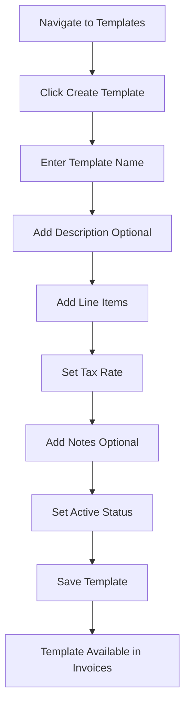
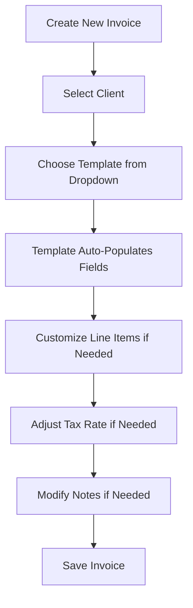

# Templates User Guide

This guide provides step-by-step instructions for using the invoice templates feature in Billing Monk.

## Quick Start

### Creating Your First Template

1. **Access Templates**
   - Click "Templates" in the sidebar menu
   - Or press `Alt+T` keyboard shortcut

2. **Create Template**
   - Click "Create Template" button
   - Fill in template name (e.g., "Consulting Services")
   - Add line items with descriptions, quantities, and rates
   - Set tax rate if applicable
   - Mark as active
   - Click "Create Template"

3. **Use Template in Invoice**
   - Go to Invoices → Create Invoice
   - Select your template from the dropdown
   - Template data auto-populates
   - Customize as needed and save

## Detailed Workflows

### Template Creation Workflow

### Invoice Creation with Templates

## Common Use Cases

### Service-Based Business

**Consulting Template**
- Strategic Planning: 20 hours @ ₹12,000/hour
- Implementation: 15 hours @ ₹10,000/hour
- Follow-up Support: 5 hours @ ₹8,000/hour

**Web Development Template**
- Design: 40 hours @ ₹6,000/hour
- Development: 60 hours @ ₹7,000/hour
- Testing: 20 hours @ ₹5,000/hour

### Product-Based Business

**Software Package Template**
- Software License: 1 unit @ ₹40,000/unit
- Installation: 4 hours @ ₹8,000/hour
- Training: 8 hours @ ₹6,000/hour
- Support Package: 1 year @ ₹16,000/year

### Recurring Services

**Monthly Maintenance Template**
- System Monitoring: 1 month @ ₹16,000/month
- Updates & Patches: 1 month @ ₹12,000/month
- Support Hours: 5 hours @ ₹8,000/hour

## Tips and Best Practices

### Template Naming

✅ **Good Examples:**
- "Web Development - Standard Package"
- "Monthly IT Support Services"
- "Consulting - Strategic Planning"

❌ **Poor Examples:**
- "Template 1"
- "Services"
- "Default"

### Line Item Descriptions

✅ **Good Examples:**
- "Frontend Development - React.js implementation with responsive design"
- "Database Setup - PostgreSQL configuration and optimization"
- "Project Management - Agile methodology with weekly sprints"

❌ **Poor Examples:**
- "Development"
- "Work"
- "Services"

### Quantity and Rate Guidelines

- **Quantities**: Use realistic default quantities that can be adjusted per invoice
- **Rates**: Keep rates current with your pricing structure
- **Consistency**: Use consistent units (hours, days, items) within templates

### Template Organization

1. **Create templates for your most common services**
2. **Use descriptive names that clearly identify the service type**
3. **Keep templates updated with current pricing**
4. **Deactivate outdated templates rather than deleting them**
5. **Create separate templates for different client types or service levels**

## Keyboard Shortcuts

| Shortcut | Action |
|----------|--------|
| `Alt+T` | Navigate to Templates |
| `Ctrl+N` | Add new line item (in template form) |
| `Ctrl+Enter` | Save template |
| `Escape` | Cancel template creation/editing |

## Troubleshooting

### Template Not Showing in Invoice Dropdown

**Possible Causes:**
- Template is marked as inactive
- Template was not saved properly
- Browser cache needs refresh

**Solutions:**
1. Check template status in Templates page
2. Edit template and ensure it's marked as active
3. Refresh browser page
4. Clear browser cache if needed

### Template Data Not Applying Correctly

**Possible Causes:**
- Template has no line items
- Template data is corrupted
- Browser JavaScript error

**Solutions:**
1. Edit template and verify line items exist
2. Check browser console for errors
3. Try creating a new template with the same data
4. Refresh page and try again

### Calculation Errors in Templates

**Possible Causes:**
- Non-numeric values in quantity or rate fields
- Tax rate entered incorrectly
- Decimal precision issues

**Solutions:**
1. Verify all quantities and rates are valid numbers
2. Enter GST rate as percentage (e.g., 18 for 18%)
3. Use reasonable decimal precision (2-3 decimal places max)

## Advanced Features

### Template Customization After Application

After applying a template to an invoice, you can:

1. **Modify Line Items**: Change descriptions, quantities, or rates
2. **Add New Items**: Include additional services not in the template
3. **Remove Items**: Delete unnecessary line items
4. **Adjust Tax Rate**: Change tax rate for specific invoices
5. **Update Notes**: Customize notes for the specific client or project

### Template Reapplication

Use the "Apply Template" button to:
- Revert changes back to template defaults
- Apply a different template to the same invoice
- Reset line items if you've made errors

### Bulk Template Management

For managing multiple templates:

1. **Review Templates Regularly**: Check the templates table monthly
2. **Update Pricing**: Adjust rates across templates as needed
3. **Archive Old Templates**: Mark outdated templates as inactive
4. **Create Template Variants**: Make variations for different client types

## Integration with Other Features

### Templates and Recurring Invoices

Templates work seamlessly with recurring invoices:

1. Create a template for recurring services
2. Set up recurring invoice using the template
3. Each generated invoice will use the template structure
4. Template changes won't affect existing recurring schedules

### Templates and Client-Specific Pricing

For client-specific pricing:

1. Create base templates with standard rates
2. Apply template to invoice
3. Adjust rates for specific client before saving
4. Consider creating client-specific templates for major clients

### Templates and Reporting

Templates help with reporting by:

1. **Standardizing Services**: Consistent service descriptions improve reporting
2. **Pricing Analysis**: Compare template usage across time periods
3. **Service Performance**: Track which templates generate the most revenue

## Getting Help

If you need assistance with templates:

1. **Check this guide** for common solutions
2. **Review the main documentation** for additional context
3. **Check GitHub issues** for known problems and solutions
4. **Contact support** for complex issues or feature requests

The template system is designed to make your invoicing faster and more consistent. With proper setup and use, templates can significantly reduce the time spent creating invoices while ensuring professional, accurate billing.